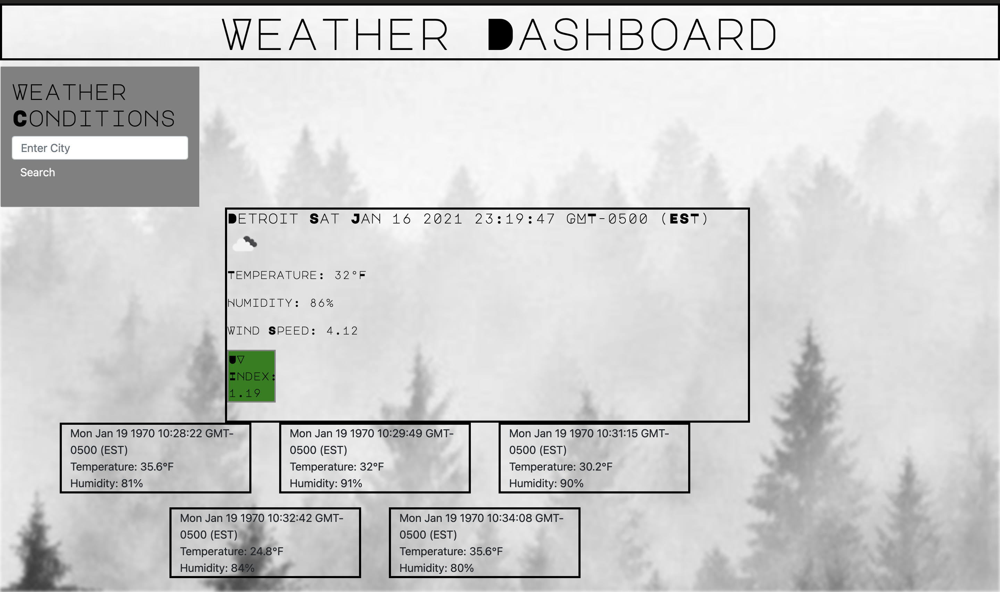

##What's the weather going to be?
Goal: Create a Weather Dashboard to allow the user to enter the name of a city and retrieve weather conditions based on the city that was entered using an API (Application Program Interface) then save data to localStorage.

##Developer Teangelo Burks

**Criteria for Weather Dashboard**

* Dynamically Update HTML & CSS code.
&nbsp;

* Use a third party API.
&nbsp;

* Display the current City, Date, Temperature, Humidity and UV Index. 
&nbsp;

* Upon displaying current weather conditions, Present the user with a  5-day forecast that displays the date, an icon representation of weather conditions, the temperature, and the humidity
&nbsp;

* Once the user inputs a city in the search form, the event is saved in local storage, Which will continue to display on the page even if the browser is refreshed.
&nbsp;

**What exactly will the user experience look like?**

**Tools used:**
* HTML
* CSS
* JavaScript
* jQuery
* Openweather API
* HTML Validator

Here is Deployed URL: [Weather Dashboard]()

>Check those Weather conditions guys!!
